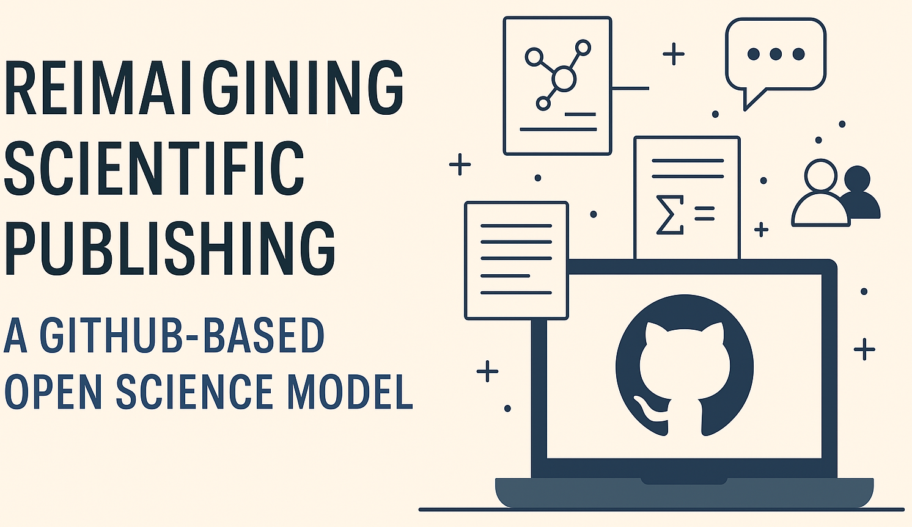

# Cookiecutter Scientific Paper

[](LICENSE)
[](https://github.com/drckf/cookiecutter-scientific-paper/issues)
[](https://github.com/cookiecutter/cookiecutter)





A [cookiecutter](https://github.com/cookiecutter/cookiecutter) template for scientific papers that embraces open science principles and collaborative GitHub-based workflows.

This template creates a comprehensive project structure with:

- Paper manuscript in Markdown with LaTeX math support
- Reproducible analysis code
- Python package for reusable methods
- Data management structure
- GitHub integration for collaboration
- Automatic DOI generation via Zenodo

## Features

- **Open Science Ready**: Built with transparency and reproducibility as core principles
- **GitHub Integrated**: Issue templates, GitHub Actions workflows, and web rendering
- **Comprehensive**: Covers paper writing, code development, and data management
- **Citable**: Includes proper citation metadata and DOI integration
- **Collaborative**: Designed for easy contributions and peer review through GitHub

## Requirements

- Python 3.7+
- Cookiecutter (`pip install cookiecutter`)
- Git

## Usage

```bash
# Create a new scientific paper project
cookiecutter gh:yourusername/cookiecutter-science-paper

# Answer the prompts to customize your project
```

## Project Structure

The generated project will have the following structure:

```
your-project-name/
├── .github/                      # GitHub integration
├── paper/                        # Manuscript and supporting files
├── src/                          # Source code for reusable package
├── code/                         # Analysis and experiment code
└── data/                         # Data management
```

## Example

For a complete example of a paper using this template, see [example-paper](https://github.com/yourusername/example-paper).

## License

This template is licensed under the MIT License - see the LICENSE file for details.
